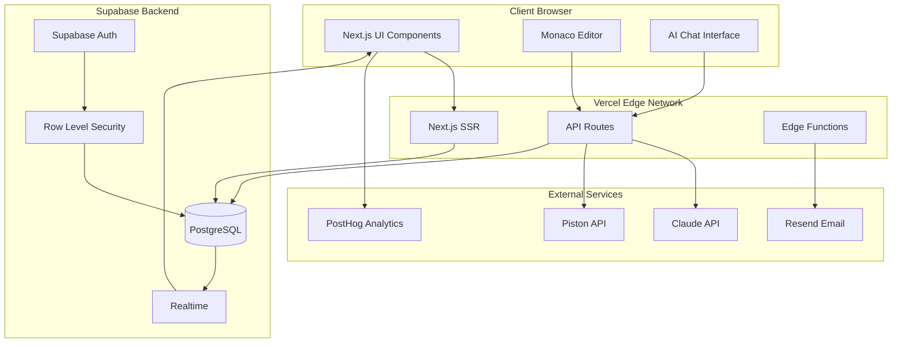
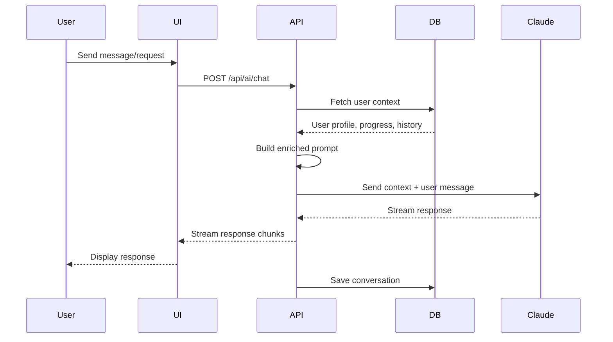
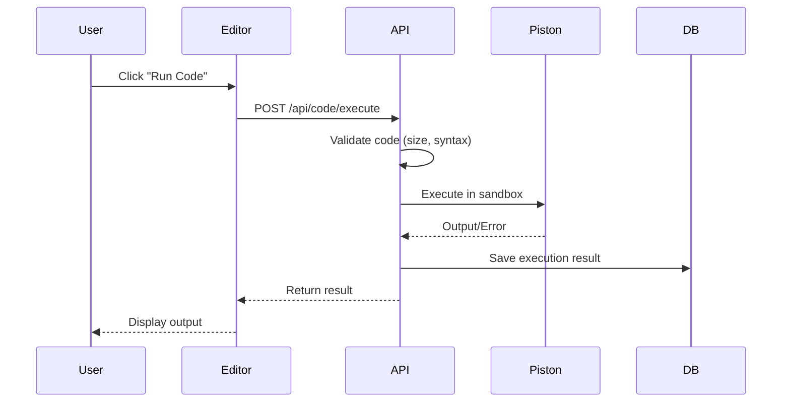
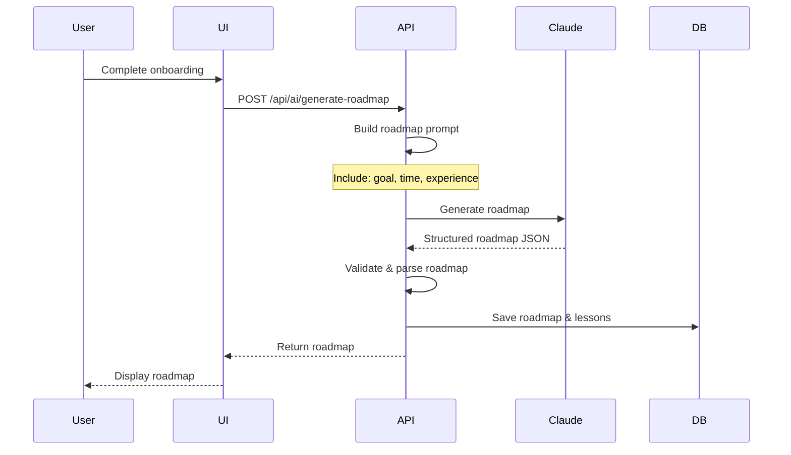
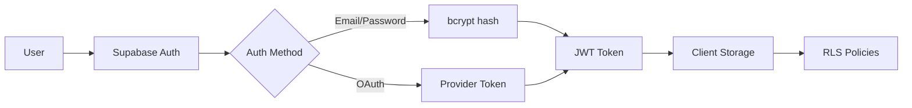
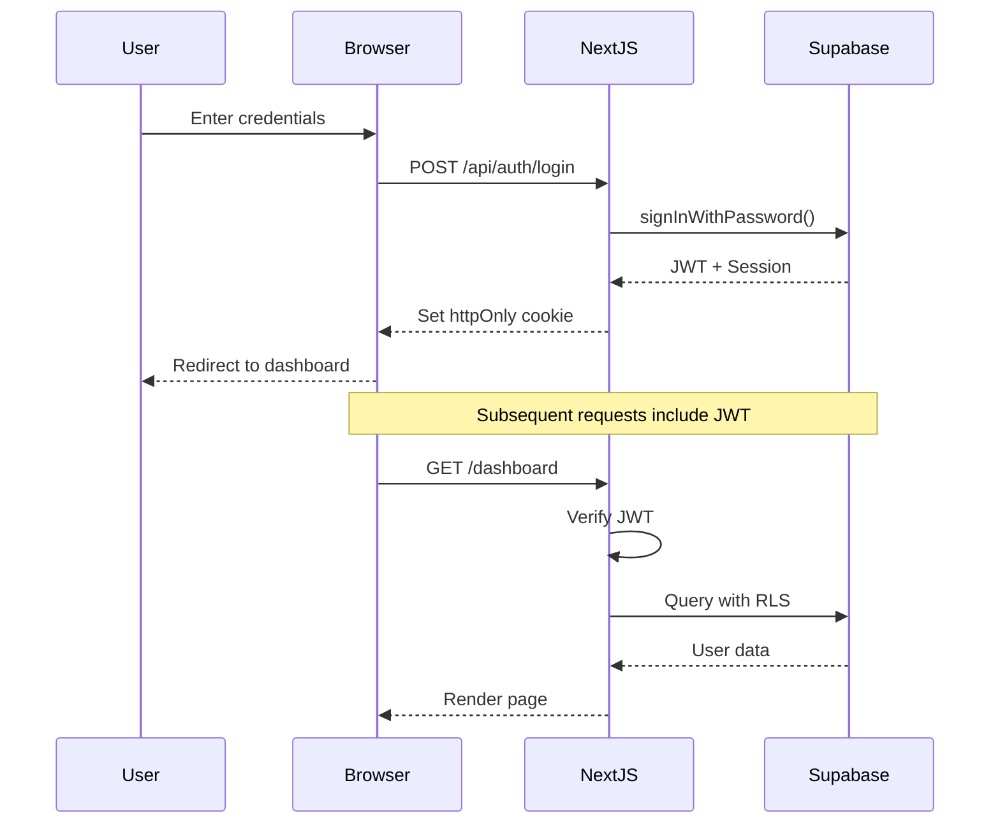

# Design Document: CodePath AI MVP

## Overview

CodePath AI is a JAMstack web application that provides personalized, AI-powered coding education through focused 15-minute learning sessions. The platform uses a goal-first approach where users describe what they want to build, and an AI mentor (powered by Claude API) generates a dynamic learning roadmap tailored to their needs.

### Core Value Proposition

- **Goal-First Learning**: Users start by describing what they want to build, not by choosing a programming language
- **AI Personalization**: Every interaction is context-aware, incorporating user history, progress, and goals
- **Micro-Sessions**: 15-minute focused lessons designed for busy learners
- **Build-as-You-Learn**: Real projects aligned with user goals, not abstract exercises
- **Free Core Tier**: Accessible to everyone with premium features for advanced users

### Target Users

1. **The Busy Beginner**: Career transitioners with limited time (30-60 min/week)
2. **App Builders**: Non-technical founders who need to prototype ideas
3. **Curious Students**: Learners exploring coding without formal CS background

### Technical Stack

- **Frontend**: Next.js 15 with App Router, React 19, Tailwind CSS
- **Deployment**: Vercel (frontend hosting, edge functions)
- **AI/LLM**: Claude API (claude-sonnet-4-20250514)
- **Database**: Supabase (PostgreSQL with Row Level Security)
- **Authentication**: Supabase Auth (email/password, OAuth)
- **Code Editor**: Monaco Editor (VS Code's editor component)
- **Code Execution**: Piston API (sandboxed multi-language execution)
- **Email**: Resend (transactional emails, re-engagement)
- **Analytics**: PostHog (product analytics, feature flags)
- **Monitoring**: Sentry (error tracking), Vercel Analytics (performance)


## Architecture

### System Architecture Pattern

CodePath AI follows a **JAMstack architecture** with three primary layers:

1. **Presentation Layer** (Next.js Frontend)
   - Server-side rendering (SSR) for initial page loads
   - Client-side rendering (CSR) for interactive components
   - Direct database queries via Supabase client
   - Static asset delivery via Vercel CDN

2. **AI Orchestration Layer** (Next.js API Routes)
   - Context enrichment for AI requests
   - Prompt engineering and template management
   - Claude API integration
   - Response streaming for real-time feedback

3. **Data Layer** (Supabase Backend)
   - PostgreSQL database with Row Level Security
   - Real-time subscriptions for live updates
   - Authentication and authorization
   - File storage for user code and projects

### High-Level Architecture Diagram



### Component Architecture

#### Frontend Components

```
app/
├── (auth)/
│   ├── login/
│   ├── register/
│   └── reset-password/
├── (onboarding)/
│   └── onboarding/
├── (dashboard)/
│   ├── dashboard/
│   ├── roadmap/
│   ├── lesson/[id]/
│   ├── project/[id]/
│   └── progress/
├── api/
│   ├── ai/
│   │   ├── chat/
│   │   ├── generate-roadmap/
│   │   └── review-code/
│   ├── code/
│   │   ├── execute/
│   │   └── save/
│   └── analytics/
└── components/
    ├── editor/
    │   ├── CodeEditor.tsx
    │   ├── CodeOutput.tsx
    │   └── CodeControls.tsx
    ├── chat/
    │   ├── ChatInterface.tsx
    │   ├── MessageList.tsx
    │   └── MessageInput.tsx
    ├── lesson/
    │   ├── LessonContent.tsx
    │   ├── LessonTimer.tsx
    │   └── LessonProgress.tsx
    └── roadmap/
        ├── RoadmapView.tsx
        ├── LessonCard.tsx
        └── ProjectMilestone.tsx
```

### Data Flow Patterns

#### 1. AI Context Enrichment Flow

Every AI request follows this pattern to ensure context-aware responses:



**Context Components**:
- User profile (name, learning goal, experience level)
- Current roadmap position (current lesson, completed lessons)
- Recent performance (completion times, error rates, difficulty level)
- Conversation history (last 10 messages)
- Current lesson content (if applicable)
- Recent code submissions (last 3)


#### 2. Code Execution Flow



#### 3. Roadmap Generation Flow



### Security Architecture

#### Authentication Flow



#### Row Level Security (RLS) Policies

All database tables implement RLS to ensure users can only access their own data:

```sql
-- Example RLS policy for user_profiles
CREATE POLICY "Users can view own profile"
  ON user_profiles FOR SELECT
  USING (auth.uid() = id);

CREATE POLICY "Users can update own profile"
  ON user_profiles FOR UPDATE
  USING (auth.uid() = id);
```

**Protected Resources**:
- User profiles
- Roadmaps and lessons
- Code submissions
- Chat history
- Progress data
- Project files


## Components and Interfaces

### Frontend Components

#### 1. Authentication Components

**LoginForm**
- Purpose: Handle user login
- Props: `onSuccess: () => void`, `redirectTo?: string`
- State: email, password, loading, error
- Methods: `handleSubmit()`, `validateForm()`
- Integration: Supabase Auth client

**RegisterForm**
- Purpose: Handle user registration
- Props: `onSuccess: () => void`
- State: name, email, password, confirmPassword, loading, error
- Methods: `handleSubmit()`, `validateForm()`, `checkPasswordStrength()`
- Integration: Supabase Auth client, creates user profile

#### 2. Onboarding Components

**OnboardingFlow**
- Purpose: Multi-step onboarding wizard
- State: currentStep, formData, loading
- Steps:
  1. Welcome & goal description
  2. Time commitment selection
  3. Experience level assessment
  4. Roadmap generation & preview
- Methods: `nextStep()`, `prevStep()`, `submitOnboarding()`
- Integration: `/api/ai/generate-roadmap`

**GoalInput**
- Purpose: Natural language goal capture
- Props: `value: string`, `onChange: (value: string) => void`
- Features: Character counter, example prompts, AI suggestions
- Validation: Min 20 characters, max 500 characters

#### 3. Code Editor Components

**CodeEditor**
- Purpose: Monaco-based code editing
- Props:
  - `language: 'javascript' | 'python' | 'html'`
  - `value: string`
  - `onChange: (value: string) => void`
  - `readOnly?: boolean`
- Features:
  - Syntax highlighting
  - Auto-completion
  - Error squiggles
  - Line numbers
  - Minimap
- Auto-save: Every 30 seconds via `/api/code/save`
- Keyboard shortcuts: Ctrl+S (save), Ctrl+Enter (run)

**CodeOutput**
- Purpose: Display execution results
- Props: `result: ExecutionResult`
- Displays:
  - Console output (stdout)
  - Return values
  - Error messages with line numbers
  - Execution time
- Styling: Monospace font, syntax highlighting for errors

**CodeControls**
- Purpose: Code execution controls
- Buttons: Run, Stop, Clear Output, Reset Code
- State: isRunning, executionTime
- Integration: `/api/code/execute`


#### 4. AI Chat Components

**ChatInterface**
- Purpose: Main chat container
- Props: `lessonId?: string`, `context?: ChatContext`
- State: messages, isLoading, inputValue
- Features:
  - Message history
  - Typing indicators
  - Auto-scroll to latest
  - Context badge (shows current lesson)
- Integration: `/api/ai/chat` with streaming

**MessageList**
- Purpose: Display chat messages
- Props: `messages: Message[]`, `isLoading: boolean`
- Features:
  - User/AI message differentiation
  - Timestamp display
  - Code block rendering with syntax highlighting
  - Markdown support
- Virtualization: For performance with long histories

**MessageInput**
- Purpose: User message input
- Props: `onSend: (message: string) => void`, `disabled: boolean`
- Features:
  - Multi-line support
  - Character counter
  - Send on Enter (Shift+Enter for new line)
  - Paste code detection

#### 5. Lesson Components

**LessonContent**
- Purpose: Display lesson material
- Props: `lesson: Lesson`
- Sections:
  - Title and description
  - Learning objectives
  - Explanation with examples
  - Code exercises
  - Success criteria
- Rendering: Markdown with code highlighting

**LessonTimer**
- Purpose: Track session time
- Props: `startTime: Date`, `targetDuration: number`
- Display: MM:SS format
- Features:
  - Visual progress bar
  - Color coding (green < 15min, yellow < 20min, red > 20min)
  - Pause/resume capability

**LessonProgress**
- Purpose: Show lesson completion status
- Props: `totalSteps: number`, `completedSteps: number`
- Display: Progress bar with percentage
- Features: Step indicators, current step highlight


#### 6. Roadmap Components

**RoadmapView**
- Purpose: Visual roadmap display
- Props: `roadmap: Roadmap`, `currentLessonId: string`
- Layout: Vertical timeline with branches for projects
- Features:
  - Completed lessons (checkmark)
  - Current lesson (highlighted)
  - Locked lessons (grayed out)
  - Project milestones (special icons)
  - Estimated time per lesson

**LessonCard**
- Purpose: Individual lesson in roadmap
- Props: `lesson: Lesson`, `status: 'completed' | 'current' | 'locked'`
- Display:
  - Lesson title
  - Duration estimate
  - Difficulty indicator
  - Prerequisites (if any)
- Actions: Click to navigate (if unlocked)

**ProjectMilestone**
- Purpose: Project marker in roadmap
- Props: `project: Project`, `status: 'completed' | 'current' | 'locked'`
- Display:
  - Project name
  - Description
  - Completion percentage
  - Deliverables list

#### 7. Dashboard Components

**ProgressDashboard**
- Purpose: Main progress overview
- Sections:
  - Learning goal display
  - Roadmap completion percentage
  - Lessons completed count
  - Projects completed count
  - Total learning time
  - Current streak
  - Recent activity feed
- Actions: Continue learning, Change goal, View roadmap

**StatsCard**
- Purpose: Individual stat display
- Props: `title: string`, `value: string | number`, `icon: ReactNode`, `trend?: number`
- Styling: Card with icon, large value, optional trend indicator

**StreakCalendar**
- Purpose: Visual streak representation
- Props: `activityData: ActivityDay[]`
- Display: GitHub-style contribution graph
- Features: Hover tooltips with daily details


### API Interfaces

#### REST API Endpoints

**Authentication Endpoints**

```typescript
POST /api/auth/register
Request: { name: string, email: string, password: string }
Response: { user: User, session: Session }

POST /api/auth/login
Request: { email: string, password: string }
Response: { user: User, session: Session }

POST /api/auth/logout
Response: { success: boolean }

POST /api/auth/reset-password
Request: { email: string }
Response: { success: boolean, message: string }
```

**AI Endpoints**

```typescript
POST /api/ai/chat
Request: {
  message: string,
  lessonId?: string,
  conversationId?: string
}
Response: Stream<{ chunk: string, done: boolean }>

POST /api/ai/generate-roadmap
Request: {
  goal: string,
  timeCommitment: number, // hours per week
  experienceLevel: 'beginner' | 'intermediate' | 'advanced'
}
Response: {
  roadmap: Roadmap,
  lessons: Lesson[],
  projects: Project[]
}

POST /api/ai/review-code
Request: {
  code: string,
  language: string,
  lessonId: string,
  projectId?: string
}
Response: {
  feedback: CodeReview,
  suggestions: Suggestion[],
  score: number
}
```

**Code Execution Endpoints**

```typescript
POST /api/code/execute
Request: {
  code: string,
  language: 'javascript' | 'python' | 'html',
  stdin?: string
}
Response: {
  stdout: string,
  stderr: string,
  exitCode: number,
  executionTime: number
}

POST /api/code/save
Request: {
  lessonId: string,
  code: string,
  language: string
}
Response: {
  success: boolean,
  savedAt: string
}
```

**Lesson & Progress Endpoints**

```typescript
GET /api/lessons/:id
Response: { lesson: Lesson }

POST /api/lessons/:id/complete
Request: { completionTime: number }
Response: { success: boolean, nextLesson?: Lesson }

GET /api/roadmap
Response: { roadmap: Roadmap, lessons: Lesson[], progress: Progress }

POST /api/roadmap/pivot
Request: { newGoal: string }
Response: { roadmap: Roadmap, lessons: Lesson[] }

GET /api/progress
Response: {
  completedLessons: number,
  totalLessons: number,
  completedProjects: number,
  totalProjects: number,
  totalTime: number,
  currentStreak: number,
  difficultyLevel: number
}
```


### External Service Interfaces

#### Claude API Integration

```typescript
interface ClaudeRequest {
  model: 'claude-sonnet-4-20250514',
  messages: Message[],
  max_tokens: number,
  temperature: number,
  stream: boolean,
  system?: string
}

interface ClaudeMessage {
  role: 'user' | 'assistant',
  content: string
}

// Wrapper service
class ClaudeService {
  async chat(userMessage: string, context: AIContext): Promise<string>
  async streamChat(userMessage: string, context: AIContext): AsyncIterator<string>
  async generateRoadmap(goal: string, profile: UserProfile): Promise<Roadmap>
  async reviewCode(code: string, criteria: ReviewCriteria): Promise<CodeReview>
}
```

#### Piston API Integration

```typescript
interface PistonRequest {
  language: string,
  version: string,
  files: Array<{ name: string, content: string }>,
  stdin?: string,
  args?: string[],
  compile_timeout?: number,
  run_timeout?: number
}

interface PistonResponse {
  run: {
    stdout: string,
    stderr: string,
    code: number,
    signal: string | null,
    output: string
  }
}

// Wrapper service
class CodeExecutionService {
  async execute(code: string, language: string): Promise<ExecutionResult>
  async validateCode(code: string, language: string): Promise<ValidationResult>
}
```

#### Supabase Client Interface

```typescript
// Database client
const supabase = createClient<Database>(
  process.env.NEXT_PUBLIC_SUPABASE_URL,
  process.env.NEXT_PUBLIC_SUPABASE_ANON_KEY
)

// Type-safe queries
const { data, error } = await supabase
  .from('user_profiles')
  .select('*')
  .eq('id', userId)
  .single()

// Real-time subscriptions
const channel = supabase
  .channel('progress-updates')
  .on('postgres_changes', {
    event: 'UPDATE',
    schema: 'public',
    table: 'user_progress'
  }, (payload) => {
    // Handle update
  })
  .subscribe()
```


## Data Models

### Database Schema

#### Core Tables

**user_profiles**
```sql
CREATE TABLE user_profiles (
  id UUID PRIMARY KEY REFERENCES auth.users(id),
  name VARCHAR(255) NOT NULL,
  email VARCHAR(255) UNIQUE NOT NULL,
  learning_goal TEXT,
  time_commitment INTEGER, -- hours per week
  experience_level VARCHAR(50),
  onboarding_completed BOOLEAN DEFAULT FALSE,
  created_at TIMESTAMP WITH TIME ZONE DEFAULT NOW(),
  updated_at TIMESTAMP WITH TIME ZONE DEFAULT NOW()
);

CREATE INDEX idx_user_profiles_email ON user_profiles(email);
```

**roadmaps**
```sql
CREATE TABLE roadmaps (
  id UUID PRIMARY KEY DEFAULT gen_random_uuid(),
  user_id UUID NOT NULL REFERENCES user_profiles(id) ON DELETE CASCADE,
  title VARCHAR(255) NOT NULL,
  description TEXT,
  goal TEXT NOT NULL,
  status VARCHAR(50) DEFAULT 'active', -- active, archived, completed
  created_at TIMESTAMP WITH TIME ZONE DEFAULT NOW(),
  updated_at TIMESTAMP WITH TIME ZONE DEFAULT NOW()
);

CREATE INDEX idx_roadmaps_user_id ON roadmaps(user_id);
CREATE INDEX idx_roadmaps_status ON roadmaps(status);
```

**lessons**
```sql
CREATE TABLE lessons (
  id UUID PRIMARY KEY DEFAULT gen_random_uuid(),
  roadmap_id UUID NOT NULL REFERENCES roadmaps(id) ON DELETE CASCADE,
  title VARCHAR(255) NOT NULL,
  description TEXT,
  content JSONB NOT NULL, -- structured lesson content
  order_index INTEGER NOT NULL,
  estimated_duration INTEGER NOT NULL, -- minutes
  difficulty_level INTEGER DEFAULT 1, -- 1-5 scale
  prerequisites UUID[], -- array of lesson IDs
  language VARCHAR(50), -- javascript, python, html
  starter_code TEXT,
  test_cases JSONB,
  created_at TIMESTAMP WITH TIME ZONE DEFAULT NOW(),
  updated_at TIMESTAMP WITH TIME ZONE DEFAULT NOW()
);

CREATE INDEX idx_lessons_roadmap_id ON lessons(roadmap_id);
CREATE INDEX idx_lessons_order ON lessons(roadmap_id, order_index);
```

**projects**
```sql
CREATE TABLE projects (
  id UUID PRIMARY KEY DEFAULT gen_random_uuid(),
  roadmap_id UUID NOT NULL REFERENCES roadmaps(id) ON DELETE CASCADE,
  title VARCHAR(255) NOT NULL,
  description TEXT NOT NULL,
  requirements JSONB NOT NULL,
  success_criteria JSONB NOT NULL,
  order_index INTEGER NOT NULL,
  estimated_duration INTEGER NOT NULL, -- minutes
  unlock_after_lesson UUID REFERENCES lessons(id),
  created_at TIMESTAMP WITH TIME ZONE DEFAULT NOW(),
  updated_at TIMESTAMP WITH TIME ZONE DEFAULT NOW()
);

CREATE INDEX idx_projects_roadmap_id ON projects(roadmap_id);
```


#### Progress Tracking Tables

**lesson_progress**
```sql
CREATE TABLE lesson_progress (
  id UUID PRIMARY KEY DEFAULT gen_random_uuid(),
  user_id UUID NOT NULL REFERENCES user_profiles(id) ON DELETE CASCADE,
  lesson_id UUID NOT NULL REFERENCES lessons(id) ON DELETE CASCADE,
  status VARCHAR(50) DEFAULT 'not_started', -- not_started, in_progress, completed
  started_at TIMESTAMP WITH TIME ZONE,
  completed_at TIMESTAMP WITH TIME ZONE,
  completion_time INTEGER, -- minutes taken
  attempts INTEGER DEFAULT 0,
  error_count INTEGER DEFAULT 0,
  created_at TIMESTAMP WITH TIME ZONE DEFAULT NOW(),
  updated_at TIMESTAMP WITH TIME ZONE DEFAULT NOW(),
  UNIQUE(user_id, lesson_id)
);

CREATE INDEX idx_lesson_progress_user_id ON lesson_progress(user_id);
CREATE INDEX idx_lesson_progress_status ON lesson_progress(user_id, status);
```

**project_submissions**
```sql
CREATE TABLE project_submissions (
  id UUID PRIMARY KEY DEFAULT gen_random_uuid(),
  user_id UUID NOT NULL REFERENCES user_profiles(id) ON DELETE CASCADE,
  project_id UUID NOT NULL REFERENCES projects(id) ON DELETE CASCADE,
  code TEXT NOT NULL,
  language VARCHAR(50) NOT NULL,
  status VARCHAR(50) DEFAULT 'submitted', -- submitted, reviewed, approved
  review_feedback JSONB,
  score INTEGER, -- 0-100
  submitted_at TIMESTAMP WITH TIME ZONE DEFAULT NOW(),
  reviewed_at TIMESTAMP WITH TIME ZONE
);

CREATE INDEX idx_project_submissions_user_id ON project_submissions(user_id);
CREATE INDEX idx_project_submissions_project_id ON project_submissions(project_id);
```

**user_progress**
```sql
CREATE TABLE user_progress (
  user_id UUID PRIMARY KEY REFERENCES user_profiles(id) ON DELETE CASCADE,
  current_roadmap_id UUID REFERENCES roadmaps(id),
  current_lesson_id UUID REFERENCES lessons(id),
  total_lessons_completed INTEGER DEFAULT 0,
  total_projects_completed INTEGER DEFAULT 0,
  total_learning_time INTEGER DEFAULT 0, -- minutes
  current_streak INTEGER DEFAULT 0, -- days
  longest_streak INTEGER DEFAULT 0,
  last_activity_date DATE,
  difficulty_level INTEGER DEFAULT 1, -- 1-5 scale
  created_at TIMESTAMP WITH TIME ZONE DEFAULT NOW(),
  updated_at TIMESTAMP WITH TIME ZONE DEFAULT NOW()
);
```


#### AI Interaction Tables

**conversations**
```sql
CREATE TABLE conversations (
  id UUID PRIMARY KEY DEFAULT gen_random_uuid(),
  user_id UUID NOT NULL REFERENCES user_profiles(id) ON DELETE CASCADE,
  lesson_id UUID REFERENCES lessons(id),
  title VARCHAR(255),
  created_at TIMESTAMP WITH TIME ZONE DEFAULT NOW(),
  updated_at TIMESTAMP WITH TIME ZONE DEFAULT NOW()
);

CREATE INDEX idx_conversations_user_id ON conversations(user_id);
CREATE INDEX idx_conversations_lesson_id ON conversations(lesson_id);
```

**messages**
```sql
CREATE TABLE messages (
  id UUID PRIMARY KEY DEFAULT gen_random_uuid(),
  conversation_id UUID NOT NULL REFERENCES conversations(id) ON DELETE CASCADE,
  role VARCHAR(50) NOT NULL, -- user, assistant
  content TEXT NOT NULL,
  context_snapshot JSONB, -- snapshot of context used for this message
  created_at TIMESTAMP WITH TIME ZONE DEFAULT NOW()
);

CREATE INDEX idx_messages_conversation_id ON messages(conversation_id);
CREATE INDEX idx_messages_created_at ON messages(conversation_id, created_at);
```

**code_saves**
```sql
CREATE TABLE code_saves (
  id UUID PRIMARY KEY DEFAULT gen_random_uuid(),
  user_id UUID NOT NULL REFERENCES user_profiles(id) ON DELETE CASCADE,
  lesson_id UUID REFERENCES lessons(id),
  project_id UUID REFERENCES projects(id),
  code TEXT NOT NULL,
  language VARCHAR(50) NOT NULL,
  saved_at TIMESTAMP WITH TIME ZONE DEFAULT NOW()
);

CREATE INDEX idx_code_saves_user_lesson ON code_saves(user_id, lesson_id);
CREATE INDEX idx_code_saves_user_project ON code_saves(user_id, project_id);
```

#### Analytics Tables

**user_events**
```sql
CREATE TABLE user_events (
  id UUID PRIMARY KEY DEFAULT gen_random_uuid(),
  user_id UUID REFERENCES user_profiles(id) ON DELETE CASCADE,
  event_type VARCHAR(100) NOT NULL,
  event_data JSONB,
  created_at TIMESTAMP WITH TIME ZONE DEFAULT NOW()
);

CREATE INDEX idx_user_events_user_id ON user_events(user_id);
CREATE INDEX idx_user_events_type ON user_events(event_type);
CREATE INDEX idx_user_events_created_at ON user_events(created_at);
```

**daily_activity**
```sql
CREATE TABLE daily_activity (
  id UUID PRIMARY KEY DEFAULT gen_random_uuid(),
  user_id UUID NOT NULL REFERENCES user_profiles(id) ON DELETE CASCADE,
  activity_date DATE NOT NULL,
  lessons_completed INTEGER DEFAULT 0,
  time_spent INTEGER DEFAULT 0, -- minutes
  messages_sent INTEGER DEFAULT 0,
  code_executions INTEGER DEFAULT 0,
  created_at TIMESTAMP WITH TIME ZONE DEFAULT NOW(),
  UNIQUE(user_id, activity_date)
);

CREATE INDEX idx_daily_activity_user_date ON daily_activity(user_id, activity_date);
```


### TypeScript Type Definitions

```typescript
// User types
interface UserProfile {
  id: string;
  name: string;
  email: string;
  learningGoal: string | null;
  timeCommitment: number | null;
  experienceLevel: 'beginner' | 'intermediate' | 'advanced' | null;
  onboardingCompleted: boolean;
  createdAt: string;
  updatedAt: string;
}

// Roadmap types
interface Roadmap {
  id: string;
  userId: string;
  title: string;
  description: string;
  goal: string;
  status: 'active' | 'archived' | 'completed';
  createdAt: string;
  updatedAt: string;
}

interface Lesson {
  id: string;
  roadmapId: string;
  title: string;
  description: string;
  content: LessonContent;
  orderIndex: number;
  estimatedDuration: number;
  difficultyLevel: number;
  prerequisites: string[];
  language: 'javascript' | 'python' | 'html';
  starterCode: string | null;
  testCases: TestCase[] | null;
  createdAt: string;
  updatedAt: string;
}

interface LessonContent {
  sections: LessonSection[];
  learningObjectives: string[];
  exercises: Exercise[];
}

interface LessonSection {
  type: 'text' | 'code' | 'image' | 'video';
  content: string;
  language?: string;
}

interface Exercise {
  id: string;
  prompt: string;
  starterCode?: string;
  solution?: string;
  hints: string[];
}

interface TestCase {
  input: any;
  expectedOutput: any;
  description: string;
}

interface Project {
  id: string;
  roadmapId: string;
  title: string;
  description: string;
  requirements: ProjectRequirement[];
  successCriteria: SuccessCriterion[];
  orderIndex: number;
  estimatedDuration: number;
  unlockAfterLesson: string | null;
  createdAt: string;
  updatedAt: string;
}

interface ProjectRequirement {
  id: string;
  description: string;
  priority: 'must' | 'should' | 'could';
}

interface SuccessCriterion {
  id: string;
  description: string;
  testable: boolean;
}

// Progress types
interface LessonProgress {
  id: string;
  userId: string;
  lessonId: string;
  status: 'not_started' | 'in_progress' | 'completed';
  startedAt: string | null;
  completedAt: string | null;
  completionTime: number | null;
  attempts: number;
  errorCount: number;
  createdAt: string;
  updatedAt: string;
}

interface UserProgress {
  userId: string;
  currentRoadmapId: string | null;
  currentLessonId: string | null;
  totalLessonsCompleted: number;
  totalProjectsCompleted: number;
  totalLearningTime: number;
  currentStreak: number;
  longestStreak: number;
  lastActivityDate: string | null;
  difficultyLevel: number;
  createdAt: string;
  updatedAt: string;
}

// AI types
interface AIContext {
  userProfile: UserProfile;
  currentLesson?: Lesson;
  recentProgress: LessonProgress[];
  conversationHistory: Message[];
  recentCodeSubmissions: CodeSave[];
  difficultyLevel: number;
}

interface Message {
  id: string;
  conversationId: string;
  role: 'user' | 'assistant';
  content: string;
  contextSnapshot: AIContext | null;
  createdAt: string;
}

interface CodeReview {
  overallFeedback: string;
  issues: CodeIssue[];
  suggestions: string[];
  score: number;
  strengths: string[];
}

interface CodeIssue {
  line: number | null;
  severity: 'error' | 'warning' | 'info';
  message: string;
  suggestion: string;
}

// Code execution types
interface ExecutionResult {
  stdout: string;
  stderr: string;
  exitCode: number;
  executionTime: number;
  error?: string;
}

interface CodeSave {
  id: string;
  userId: string;
  lessonId: string | null;
  projectId: string | null;
  code: string;
  language: string;
  savedAt: string;
}
```


## AI Prompt Engineering Strategy

### Context Enrichment Architecture

Every AI request includes a structured context to ensure personalized, relevant responses:

```typescript
interface PromptContext {
  systemPrompt: string;
  userContext: {
    name: string;
    learningGoal: string;
    experienceLevel: string;
    currentLesson?: {
      title: string;
      content: string;
      objectives: string[];
    };
    progressSummary: {
      lessonsCompleted: number;
      currentStreak: number;
      difficultyLevel: number;
    };
  };
  conversationHistory: Message[];
  recentCode?: {
    code: string;
    language: string;
    feedback?: string;
  }[];
}
```

### System Prompts

#### Base AI Mentor Prompt

```
You are an AI coding mentor for CodePath AI, a personalized learning platform. Your role is to:

1. Guide learners toward their specific goals (not generic programming knowledge)
2. Provide encouragement and maintain a supportive, patient tone
3. Explain concepts clearly with practical examples
4. Break down complex topics into digestible pieces
5. Ask clarifying questions when needed
6. Celebrate progress and milestones

Current learner context:
- Name: {name}
- Goal: {learningGoal}
- Experience: {experienceLevel}
- Progress: {lessonsCompleted} lessons completed, {currentStreak} day streak
- Current lesson: {currentLessonTitle}

Guidelines:
- Keep responses concise (2-3 paragraphs max unless explaining complex concepts)
- Use code examples when helpful
- Reference the learner's goal to maintain motivation
- Adapt difficulty based on their experience level
- If they're stuck, provide hints before solutions
```


#### Roadmap Generation Prompt

```
Generate a personalized coding roadmap for a learner with the following profile:

Goal: {learningGoal}
Time commitment: {timeCommitment} hours per week
Experience level: {experienceLevel}

Requirements:
1. Create a roadmap with 15-25 lessons that directly support achieving their goal
2. Each lesson must be completable in 15 minutes or less
3. Include 3-5 project milestones that build toward their goal
4. Order lessons by prerequisite dependencies
5. Start with fundamentals only if necessary for their goal
6. Focus on practical, hands-on learning

Output format (JSON):
{
  "roadmap": {
    "title": "string",
    "description": "string",
    "estimatedWeeks": number
  },
  "lessons": [
    {
      "title": "string",
      "description": "string",
      "orderIndex": number,
      "estimatedDuration": number (minutes),
      "difficultyLevel": number (1-5),
      "prerequisites": ["lessonId"],
      "language": "javascript" | "python" | "html",
      "content": {
        "sections": [...],
        "learningObjectives": [...],
        "exercises": [...]
      },
      "starterCode": "string"
    }
  ],
  "projects": [
    {
      "title": "string",
      "description": "string",
      "orderIndex": number,
      "requirements": [...],
      "successCriteria": [...],
      "unlockAfterLesson": "lessonId"
    }
  ]
}
```

#### Code Review Prompt

```
Review the following code submission for a coding learner:

Learner context:
- Experience level: {experienceLevel}
- Current lesson: {lessonTitle}
- Learning objective: {learningObjective}

Code:
```{language}
{code}
```

Evaluation criteria:
1. Correctness: Does it solve the problem?
2. Code quality: Is it readable and well-structured?
3. Best practices: Does it follow language conventions?
4. Learning alignment: Does it demonstrate understanding of the lesson concepts?

Provide feedback in this JSON format:
{
  "overallFeedback": "string (2-3 sentences)",
  "score": number (0-100),
  "strengths": ["string"],
  "issues": [
    {
      "line": number | null,
      "severity": "error" | "warning" | "info",
      "message": "string",
      "suggestion": "string"
    }
  ],
  "suggestions": ["string"],
  "nextSteps": "string"
}

Tone: Encouraging and constructive. Celebrate what they did well before addressing issues.
```


### Prompt Template Management

```typescript
class PromptTemplateService {
  private templates: Map<string, PromptTemplate>;

  constructor() {
    this.templates = new Map([
      ['mentor-chat', mentorChatTemplate],
      ['roadmap-generation', roadmapGenerationTemplate],
      ['code-review', codeReviewTemplate],
      ['difficulty-adjustment', difficultyAdjustmentTemplate]
    ]);
  }

  buildPrompt(templateName: string, context: AIContext): string {
    const template = this.templates.get(templateName);
    if (!template) throw new Error(`Template ${templateName} not found`);
    
    return template.render(context);
  }

  enrichContext(baseContext: Partial<AIContext>): AIContext {
    // Fetch additional context from database
    // Merge with base context
    // Return complete context
  }
}
```

### Response Streaming

For real-time AI responses, implement streaming:

```typescript
async function* streamChatResponse(
  message: string,
  context: AIContext
): AsyncGenerator<string> {
  const prompt = buildPrompt('mentor-chat', context);
  
  const response = await fetch('https://api.anthropic.com/v1/messages', {
    method: 'POST',
    headers: {
      'Content-Type': 'application/json',
      'x-api-key': process.env.CLAUDE_API_KEY,
      'anthropic-version': '2023-06-01'
    },
    body: JSON.stringify({
      model: 'claude-sonnet-4-20250514',
      messages: [{ role: 'user', content: prompt }],
      max_tokens: 1024,
      stream: true
    })
  });

  const reader = response.body?.getReader();
  const decoder = new TextDecoder();

  while (true) {
    const { done, value } = await reader.read();
    if (done) break;
    
    const chunk = decoder.decode(value);
    const lines = chunk.split('\n').filter(line => line.trim());
    
    for (const line of lines) {
      if (line.startsWith('data: ')) {
        const data = JSON.parse(line.slice(6));
        if (data.type === 'content_block_delta') {
          yield data.delta.text;
        }
      }
    }
  }
}
```


## Security and Data Flow

### Authentication Flow



### Row Level Security Policies

```sql
-- User profiles: Users can only access their own profile
CREATE POLICY "Users can view own profile"
  ON user_profiles FOR SELECT
  USING (auth.uid() = id);

CREATE POLICY "Users can update own profile"
  ON user_profiles FOR UPDATE
  USING (auth.uid() = id);

-- Roadmaps: Users can only access their own roadmaps
CREATE POLICY "Users can view own roadmaps"
  ON roadmaps FOR SELECT
  USING (auth.uid() = user_id);

CREATE POLICY "Users can update own roadmaps"
  ON roadmaps FOR UPDATE
  USING (auth.uid() = user_id);

-- Lessons: Users can view lessons from their roadmaps
CREATE POLICY "Users can view lessons from own roadmaps"
  ON lessons FOR SELECT
  USING (
    EXISTS (
      SELECT 1 FROM roadmaps
      WHERE roadmaps.id = lessons.roadmap_id
      AND roadmaps.user_id = auth.uid()
    )
  );

-- Lesson progress: Users can only access their own progress
CREATE POLICY "Users can view own progress"
  ON lesson_progress FOR SELECT
  USING (auth.uid() = user_id);

CREATE POLICY "Users can insert own progress"
  ON lesson_progress FOR INSERT
  WITH CHECK (auth.uid() = user_id);

CREATE POLICY "Users can update own progress"
  ON lesson_progress FOR UPDATE
  USING (auth.uid() = user_id);

-- Messages: Users can only access their own conversations
CREATE POLICY "Users can view own messages"
  ON messages FOR SELECT
  USING (
    EXISTS (
      SELECT 1 FROM conversations
      WHERE conversations.id = messages.conversation_id
      AND conversations.user_id = auth.uid()
    )
  );

-- Code saves: Users can only access their own code
CREATE POLICY "Users can view own code saves"
  ON code_saves FOR SELECT
  USING (auth.uid() = user_id);

CREATE POLICY "Users can insert own code saves"
  ON code_saves FOR INSERT
  WITH CHECK (auth.uid() = user_id);
```


### API Security

#### Rate Limiting

```typescript
// Middleware for API routes
import { Ratelimit } from '@upstash/ratelimit';
import { Redis } from '@upstash/redis';

const ratelimit = new Ratelimit({
  redis: Redis.fromEnv(),
  limiter: Ratelimit.slidingWindow(10, '10 s'), // 10 requests per 10 seconds
  analytics: true
});

export async function rateLimit(req: Request): Promise<boolean> {
  const ip = req.headers.get('x-forwarded-for') ?? 'anonymous';
  const { success } = await ratelimit.limit(ip);
  return success;
}

// Apply to AI endpoints
export async function POST(req: Request) {
  if (!await rateLimit(req)) {
    return new Response('Too many requests', { status: 429 });
  }
  // Handle request
}
```

#### Input Validation

```typescript
import { z } from 'zod';

// Validation schemas
const chatMessageSchema = z.object({
  message: z.string().min(1).max(2000),
  lessonId: z.string().uuid().optional(),
  conversationId: z.string().uuid().optional()
});

const codeExecutionSchema = z.object({
  code: z.string().min(1).max(50000), // 50KB limit
  language: z.enum(['javascript', 'python', 'html']),
  stdin: z.string().max(10000).optional()
});

const roadmapGenerationSchema = z.object({
  goal: z.string().min(20).max(500),
  timeCommitment: z.number().min(1).max(40),
  experienceLevel: z.enum(['beginner', 'intermediate', 'advanced'])
});

// Usage in API routes
export async function POST(req: Request) {
  const body = await req.json();
  const validated = chatMessageSchema.safeParse(body);
  
  if (!validated.success) {
    return new Response(
      JSON.stringify({ error: 'Invalid input', details: validated.error }),
      { status: 400 }
    );
  }
  
  // Process validated data
}
```

#### Code Execution Sandboxing

```typescript
class CodeExecutionService {
  private readonly MAX_EXECUTION_TIME = 30000; // 30 seconds
  private readonly MAX_CODE_SIZE = 50000; // 50KB
  
  async execute(code: string, language: string): Promise<ExecutionResult> {
    // Validate code size
    if (code.length > this.MAX_CODE_SIZE) {
      throw new Error('Code exceeds maximum size');
    }
    
    // Sanitize code (remove dangerous patterns)
    const sanitized = this.sanitizeCode(code, language);
    
    // Execute via Piston API (already sandboxed)
    const response = await fetch('https://emkc.org/api/v2/piston/execute', {
      method: 'POST',
      headers: { 'Content-Type': 'application/json' },
      body: JSON.stringify({
        language: this.mapLanguage(language),
        version: '*',
        files: [{ name: 'main', content: sanitized }],
        run_timeout: this.MAX_EXECUTION_TIME
      })
    });
    
    const result = await response.json();
    return this.parseResult(result);
  }
  
  private sanitizeCode(code: string, language: string): string {
    // Remove potentially dangerous patterns
    // This is a basic example - expand based on security requirements
    const dangerousPatterns = [
      /require\(['"]fs['"]\)/g,  // Node.js file system
      /import\s+os/g,             // Python OS module
      /__import__/g               // Python dynamic imports
    ];
    
    let sanitized = code;
    for (const pattern of dangerousPatterns) {
      sanitized = sanitized.replace(pattern, '/* REMOVED */');
    }
    
    return sanitized;
  }
}
```


### Data Privacy and GDPR Compliance

#### Data Export

```typescript
// API endpoint: GET /api/user/export
export async function GET(req: Request) {
  const user = await getAuthenticatedUser(req);
  
  // Gather all user data
  const userData = {
    profile: await getUserProfile(user.id),
    roadmaps: await getUserRoadmaps(user.id),
    progress: await getUserProgress(user.id),
    conversations: await getUserConversations(user.id),
    codeSaves: await getUserCodeSaves(user.id),
    projects: await getUserProjects(user.id)
  };
  
  // Return as downloadable JSON
  return new Response(JSON.stringify(userData, null, 2), {
    headers: {
      'Content-Type': 'application/json',
      'Content-Disposition': 'attachment; filename="codepath-data.json"'
    }
  });
}
```

#### Data Deletion

```typescript
// API endpoint: DELETE /api/user/account
export async function DELETE(req: Request) {
  const user = await getAuthenticatedUser(req);
  
  // Cascade delete all user data
  await supabase.from('user_profiles').delete().eq('id', user.id);
  // RLS and CASCADE constraints handle related data
  
  // Delete auth user
  await supabase.auth.admin.deleteUser(user.id);
  
  return new Response(JSON.stringify({ success: true }), {
    status: 200
  });
}
```

### Environment Variables

```bash
# .env.local
NEXT_PUBLIC_SUPABASE_URL=https://xxx.supabase.co
NEXT_PUBLIC_SUPABASE_ANON_KEY=eyJxxx...
SUPABASE_SERVICE_ROLE_KEY=eyJxxx...

CLAUDE_API_KEY=sk-ant-xxx
CLAUDE_MODEL=claude-sonnet-4-20250514

PISTON_API_URL=https://emkc.org/api/v2/piston

RESEND_API_KEY=re_xxx
RESEND_FROM_EMAIL=noreply@codepath.ai

POSTHOG_API_KEY=phc_xxx
NEXT_PUBLIC_POSTHOG_HOST=https://app.posthog.com

SENTRY_DSN=https://xxx@sentry.io/xxx

UPSTASH_REDIS_REST_URL=https://xxx.upstash.io
UPSTASH_REDIS_REST_TOKEN=xxx

# Security
JWT_SECRET=xxx
ENCRYPTION_KEY=xxx
```


## Performance Optimization

### Frontend Performance

#### Code Splitting

```typescript
// Dynamic imports for heavy components
import dynamic from 'next/dynamic';

const CodeEditor = dynamic(() => import('@/components/editor/CodeEditor'), {
  loading: () => <EditorSkeleton />,
  ssr: false // Monaco Editor doesn't work with SSR
});

const ChatInterface = dynamic(() => import('@/components/chat/ChatInterface'), {
  loading: () => <ChatSkeleton />
});
```

#### Image Optimization

```typescript
import Image from 'next/image';

// Automatic optimization, lazy loading, responsive images
<Image
  src="/lesson-diagram.png"
  alt="Lesson diagram"
  width={800}
  height={600}
  priority={false} // Lazy load by default
  placeholder="blur"
/>
```

#### Caching Strategy

```typescript
// API route caching
export const revalidate = 3600; // Revalidate every hour

// Client-side caching with SWR
import useSWR from 'swr';

function useUserProgress() {
  const { data, error, mutate } = useSWR(
    '/api/progress',
    fetcher,
    {
      revalidateOnFocus: false,
      revalidateOnReconnect: false,
      dedupingInterval: 60000 // 1 minute
    }
  );
  
  return { progress: data, isLoading: !error && !data, mutate };
}
```

### Database Performance

#### Indexing Strategy

```sql
-- Already created in schema, but key indexes:
CREATE INDEX idx_user_profiles_email ON user_profiles(email);
CREATE INDEX idx_roadmaps_user_id ON roadmaps(user_id);
CREATE INDEX idx_lessons_roadmap_id ON lessons(roadmap_id);
CREATE INDEX idx_lesson_progress_user_id ON lesson_progress(user_id);
CREATE INDEX idx_messages_conversation_id ON messages(conversation_id);

-- Composite indexes for common queries
CREATE INDEX idx_lesson_progress_user_status 
  ON lesson_progress(user_id, status);

CREATE INDEX idx_messages_conversation_created 
  ON messages(conversation_id, created_at DESC);

CREATE INDEX idx_daily_activity_user_date 
  ON daily_activity(user_id, activity_date DESC);
```

#### Query Optimization

```typescript
// Efficient query with joins
const { data: lessonsWithProgress } = await supabase
  .from('lessons')
  .select(`
    *,
    lesson_progress!inner(status, completed_at)
  `)
  .eq('roadmap_id', roadmapId)
  .eq('lesson_progress.user_id', userId)
  .order('order_index');

// Pagination for large datasets
const { data: messages } = await supabase
  .from('messages')
  .select('*')
  .eq('conversation_id', conversationId)
  .order('created_at', { ascending: false })
  .range(0, 49); // First 50 messages
```


### API Performance

#### Response Time Targets

- Page load (SSR): < 3 seconds
- AI chat response (first token): < 2 seconds
- AI chat response (complete): < 5 seconds
- Code execution: < 10 seconds
- Database queries: < 500ms
- API endpoints: < 1 second

#### Optimization Techniques

```typescript
// 1. Parallel data fetching
async function getDashboardData(userId: string) {
  const [profile, progress, roadmap, recentActivity] = await Promise.all([
    getUserProfile(userId),
    getUserProgress(userId),
    getCurrentRoadmap(userId),
    getRecentActivity(userId, 7) // Last 7 days
  ]);
  
  return { profile, progress, roadmap, recentActivity };
}

// 2. Streaming responses for AI
export async function POST(req: Request) {
  const { message, context } = await req.json();
  
  const stream = new ReadableStream({
    async start(controller) {
      for await (const chunk of streamChatResponse(message, context)) {
        controller.enqueue(new TextEncoder().encode(chunk));
      }
      controller.close();
    }
  });
  
  return new Response(stream, {
    headers: { 'Content-Type': 'text/event-stream' }
  });
}

// 3. Background jobs for heavy operations
import { Queue } from 'bullmq';

const roadmapQueue = new Queue('roadmap-generation');

// Enqueue roadmap generation
await roadmapQueue.add('generate', {
  userId,
  goal,
  timeCommitment,
  experienceLevel
});

// Process in background worker
roadmapQueue.process('generate', async (job) => {
  const roadmap = await generateRoadmap(job.data);
  await saveRoadmap(roadmap);
  await notifyUser(job.data.userId);
});
```

### Monitoring and Observability

#### Error Tracking (Sentry)

```typescript
import * as Sentry from '@sentry/nextjs';

Sentry.init({
  dsn: process.env.SENTRY_DSN,
  tracesSampleRate: 0.1,
  environment: process.env.NODE_ENV
});

// Capture errors with context
try {
  await executeCode(code, language);
} catch (error) {
  Sentry.captureException(error, {
    tags: { feature: 'code-execution' },
    extra: { code, language, userId }
  });
  throw error;
}
```

#### Performance Monitoring

```typescript
// Custom performance tracking
import { performance } from 'perf_hooks';

async function trackPerformance<T>(
  operation: string,
  fn: () => Promise<T>
): Promise<T> {
  const start = performance.now();
  
  try {
    const result = await fn();
    const duration = performance.now() - start;
    
    // Log to analytics
    await logMetric({
      metric: 'operation_duration',
      operation,
      duration,
      success: true
    });
    
    return result;
  } catch (error) {
    const duration = performance.now() - start;
    
    await logMetric({
      metric: 'operation_duration',
      operation,
      duration,
      success: false
    });
    
    throw error;
  }
}

// Usage
const roadmap = await trackPerformance(
  'roadmap_generation',
  () => generateRoadmap(goal, profile)
);
```


### Scalability Considerations

#### Horizontal Scaling

- **Frontend**: Vercel automatically scales Next.js deployments
- **Database**: Supabase handles connection pooling and read replicas
- **AI Requests**: Implement queue system for high load periods
- **Code Execution**: Piston API handles sandboxing and scaling

#### Load Testing Targets

- 10,000 concurrent users at launch
- 100 requests/second to AI endpoints
- 500 requests/second to database
- 50 concurrent code executions

#### Caching Layers

```typescript
// 1. CDN caching (Vercel Edge)
export const config = {
  runtime: 'edge'
};

// 2. Redis caching for expensive operations
import { Redis } from '@upstash/redis';

const redis = Redis.fromEnv();

async function getCachedRoadmap(userId: string): Promise<Roadmap | null> {
  const cached = await redis.get(`roadmap:${userId}`);
  if (cached) return JSON.parse(cached as string);
  
  const roadmap = await fetchRoadmap(userId);
  await redis.set(`roadmap:${userId}`, JSON.stringify(roadmap), {
    ex: 3600 // 1 hour TTL
  });
  
  return roadmap;
}

// 3. In-memory caching for static content
const lessonContentCache = new Map<string, LessonContent>();

async function getLessonContent(lessonId: string): Promise<LessonContent> {
  if (lessonContentCache.has(lessonId)) {
    return lessonContentCache.get(lessonId)!;
  }
  
  const content = await fetchLessonContent(lessonId);
  lessonContentCache.set(lessonId, content);
  return content;
}
```


## Correctness Properties

*A property is a characteristic or behavior that should hold true across all valid executions of a system—essentially, a formal statement about what the system should do. Properties serve as the bridge between human-readable specifications and machine-verifiable correctness guarantees.*

### Property Reflection

After analyzing all acceptance criteria, I identified several areas of redundancy:

1. **Round-trip properties**: Multiple criteria test data persistence (registration → profile query, onboarding → profile query, code save → restore). These can be consolidated into general persistence properties.

2. **UI presence checks**: Many criteria test that UI elements exist (buttons, forms, displays). These are better tested as examples rather than properties.

3. **Context inclusion**: Multiple criteria (4.2, 4.3, 4.4) test that AI context includes specific fields. These can be combined into one comprehensive property.

4. **Progress calculations**: Multiple dashboard criteria (10.2-10.6) test that displayed values match database values. These share the same pattern.

5. **Data access control**: Criteria 16.5 tests the same concept as RLS policies - users can only access their own data.

The following properties represent the unique, testable behaviors after eliminating redundancy:

### Authentication & User Management Properties

### Property 1: Registration creates complete user profile

*For any* valid email and password combination, when a user registers, querying the database should return a user profile containing name, email, and registration timestamp.

**Validates: Requirements 1.1, 1.3, 1.4**

### Property 2: Authentication round-trip

*For any* registered user with valid credentials, authentication should succeed and return a valid session token, while invalid credentials should be rejected.

**Validates: Requirements 1.2**

### Property 3: Onboarding-based routing

*For any* authenticated user, if onboarding is incomplete, accessing protected pages should redirect to the onboarding flow; if complete, should allow access to the requested page.

**Validates: Requirements 1.5, 2.6**

### Property 4: Onboarding data persistence

*For any* completed onboarding submission, querying the user profile should return all submitted data (goal, time commitment, experience level).

**Validates: Requirements 2.7**


### Roadmap Generation Properties

### Property 5: Roadmap prerequisite ordering

*For any* generated roadmap, lessons should be ordered such that no lesson appears before any of its prerequisites (topological sort property).

**Validates: Requirements 3.3**

### Property 6: Roadmap persistence

*For any* completed onboarding, the generated roadmap should be stored in the database linked to the user's ID and retrievable via query.

**Validates: Requirements 3.1, 3.5**

### Property 7: Lesson duration constraints

*For any* generated roadmap, all lesson estimated durations should be multiples of 15 minutes and not exceed 15 minutes.

**Validates: Requirements 3.7, 5.3**

### Property 8: Minimum project count

*For any* generated roadmap, the count of associated projects should be at least 3.

**Validates: Requirements 8.1**

### AI Context Properties

### Property 9: AI context completeness

*For any* AI chat request, the context should include all required fields: user profile (name, goal, experience level), current lesson (if applicable), recent progress, conversation history, and recent code submissions.

**Validates: Requirements 4.2, 4.3, 4.4**

### Property 10: Message persistence

*For any* chat message sent by a user, querying the messages table should return the message with correct conversation ID, role, content, and timestamp.

**Validates: Requirements 4.6**

### Property 11: Message chronological ordering

*For any* conversation, messages should be ordered by creation timestamp in ascending order.

**Validates: Requirements 4.7**


### Lesson Progress Properties

### Property 12: Lesson start timestamp recording

*For any* lesson start action, a lesson_progress record should be created with a start timestamp within 1 second of the action.

**Validates: Requirements 5.4**

### Property 13: Lesson completion state transition

*For any* lesson completion action, the lesson_progress status should change from 'in_progress' to 'completed' and include a completion timestamp.

**Validates: Requirements 5.6**

### Property 14: Sequential lesson unlocking

*For any* completed lesson, the next lesson in the roadmap (by order_index) should become accessible to the user.

**Validates: Requirements 5.7**

### Property 15: Lesson pause-resume state preservation

*For any* lesson in progress, pausing should save the current state (code, scroll position, timer), and resuming should restore that exact state.

**Validates: Requirements 5.8**

### Property 16: Lesson content structure

*For any* displayed lesson, the content should include all required sections: explanations, examples, and exercises.

**Validates: Requirements 5.2**

### Code Editor Properties

### Property 17: Code persistence round-trip

*For any* code written in the editor, after auto-save (or manual save), navigating away and returning to the same lesson should restore the exact code content.

**Validates: Requirements 6.5, 6.6**

### Property 18: Multi-language support

*For any* code execution request in JavaScript, Python, or HTML/CSS, the executor should process the request (success or code error, not "unsupported language" error).

**Validates: Requirements 7.4**

### Property 19: Execution result structure

*For any* code execution, the result should include separate fields for stdout, stderr, exit code, and execution time.

**Validates: Requirements 7.8**

### Property 20: Execution error line numbers

*For any* code execution that produces an error, if the executor provides line numbers, they should be displayed in the error message.

**Validates: Requirements 7.6**


### Project Properties

### Property 21: Project requirements display

*For any* project, the displayed interface should include both requirements and success criteria fields populated with data.

**Validates: Requirements 8.2**

### Property 22: Project code persistence

*For any* project workspace, code should be saved with timestamps and retrievable for the specific project-user combination.

**Validates: Requirements 8.3, 8.5**

### Property 23: Project completion linkage

*For any* completed project, querying the user's profile should show the project in their completed projects list.

**Validates: Requirements 8.6**

### Property 24: Code review generation

*For any* project code submission, an AI review request should be triggered and return a CodeReview object with feedback, issues, and score.

**Validates: Requirements 9.1**

### Property 25: Code review issue structure

*For any* code review containing issues, each issue should include severity, message, suggestion, and line number (or null).

**Validates: Requirements 9.4**

### Progress Dashboard Properties

### Property 26: Roadmap completion accuracy

*For any* user, the displayed roadmap completion percentage should equal (completed lessons / total lessons) × 100.

**Validates: Requirements 10.2**

### Property 27: Lesson count accuracy

*For any* user, the displayed lessons completed count should match the count of lesson_progress records with status 'completed'.

**Validates: Requirements 10.3**

### Property 28: Project count accuracy

*For any* user, the displayed projects completed count should match the count of project_submissions with status 'approved'.

**Validates: Requirements 10.4**

### Property 29: Learning time accuracy

*For any* user, the displayed total learning time should equal the sum of all completion_time values from lesson_progress records.

**Validates: Requirements 10.5**

### Property 30: Streak calculation accuracy

*For any* user, the current streak should equal the number of consecutive days (from today backward) with activity in the daily_activity table.

**Validates: Requirements 10.6**


### Adaptive Difficulty Properties

### Property 31: Performance metrics tracking

*For any* lesson completion, the system should record completion_time and error_count in the lesson_progress table.

**Validates: Requirements 11.1**

### Property 32: Difficulty adjustment persistence

*For any* difficulty level change, the new level should be stored in user_progress and a record created in the user's learning history.

**Validates: Requirements 11.6**

### Property 33: Difficulty-based content selection

*For any* user with a specific difficulty level, upcoming lessons should have difficulty_level values appropriate to the user's current level (±1 level).

**Validates: Requirements 11.4**

### Property 34: Difficulty adjustment notification

*For any* difficulty level change, a notification should be generated and displayed to the user.

**Validates: Requirements 11.5**

### Re-engagement Properties

### Property 35: Reminder personalization

*For any* re-engagement email, the content should include the user's learning goal and current progress data.

**Validates: Requirements 12.2**

### Property 36: Reminder link inclusion

*For any* re-engagement email, the email body should contain a direct link to the user's next lesson.

**Validates: Requirements 12.3**

### Property 37: Reminder frequency limit

*For any* user, re-engagement emails should not be sent more frequently than once every 3 days.

**Validates: Requirements 12.4**

### Property 38: Opt-out respect

*For any* user who has opted out of re-engagement emails, no reminder emails should be sent regardless of inactivity.

**Validates: Requirements 12.5**

### Property 39: Email tracking persistence

*For any* sent re-engagement email, tracking data (sent timestamp, open status, click status) should be stored in the database.

**Validates: Requirements 12.6**


### Goal Pivot Properties

### Property 40: Goal pivot roadmap generation

*For any* goal pivot action, a new roadmap should be generated and stored with status 'active'.

**Validates: Requirements 13.4**

### Property 41: Historical data preservation

*For any* goal pivot, all previously completed lessons and projects should remain in the database with their original completion data.

**Validates: Requirements 13.5**

### Property 42: Previous roadmap archival

*For any* goal pivot, the previous roadmap's status should change from 'active' to 'archived'.

**Validates: Requirements 13.6**

### Responsive Design Properties

### Property 43: Font size constraints

*For any* text element in the application, the computed font size should be between 14px and 18px (inclusive).

**Validates: Requirements 14.5**

### Error Handling Properties

### Property 44: API failure graceful degradation

*For any* API request failure, the application should display an error message and remain functional (no crash or blank screen).

**Validates: Requirements 15.3**

### Property 45: Error boundary protection

*For any* component error, the error boundary should catch it, log it, and display fallback UI instead of crashing the entire application.

**Validates: Requirements 15.5**

### Property 46: Error logging

*For any* application error, an error log entry should be sent to the monitoring service (Sentry) with context.

**Validates: Requirements 15.6**

### Property 47: Form validation feedback

*For any* form submission with invalid fields, each invalid field should be highlighted with a specific error message.

**Validates: Requirements 19.2**

### Property 48: Code execution error display

*For any* code execution that fails, both the error message and stack trace should be displayed to the user.

**Validates: Requirements 19.3**

### Property 49: AI request retry availability

*For any* failed AI request, a retry option should be presented to the user.

**Validates: Requirements 19.4**

### Property 50: Success message display

*For any* successful action (lesson completion, code submission, etc.), a success message should be displayed to the user.

**Validates: Requirements 19.5**

### Property 51: Actionable error guidance

*For any* error message, when actionable next steps are available, they should be included in the message.

**Validates: Requirements 19.7**


### Security Properties

### Property 52: Password encryption

*For any* user registration, the stored password should be bcrypt hashed with at least 10 salt rounds (not stored in plaintext).

**Validates: Requirements 16.2**

### Property 53: Data access isolation

*For any* user, attempting to query another user's data should be denied by Row Level Security policies.

**Validates: Requirements 16.5**

### Property 54: Data export completeness

*For any* user data export request, the returned data should include all user-related records: profile, roadmaps, progress, conversations, code saves, and projects.

**Validates: Requirements 16.8**

### Property 55: Account deletion completeness

*For any* account deletion request, all user-related data should be removed from the database (verified by querying for user ID returns no results).

**Validates: Requirements 16.9**

### Analytics Properties

### Property 56: Onboarding completion rate calculation

*For any* time period, the onboarding completion rate should equal (users who completed onboarding / total registered users) × 100.

**Validates: Requirements 17.1**

### Property 57: Day-7 retention calculation

*For any* user cohort, the Day-7 retention rate should equal (users active on day 7 / total users in cohort) × 100.

**Validates: Requirements 17.2**

### Property 58: Projects per user calculation

*For any* time period, projects per active user should equal (total projects completed / count of active users).

**Validates: Requirements 17.3**

### Property 59: Average session duration calculation

*For any* time period, average session duration should equal (sum of all session durations / count of sessions).

**Validates: Requirements 17.4**

### Property 60: Lesson completion rate calculation

*For any* lesson, the completion rate should equal (users who completed / users who started) × 100.

**Validates: Requirements 17.5**

### Property 61: Chat usage frequency tracking

*For any* time period, chat usage frequency should equal the count of messages with role 'user' in that period.

**Validates: Requirements 17.6**

### Property 62: Analytics event timestamping

*For any* tracked event, the event record should include a timestamp within 1 second of when the event occurred.

**Validates: Requirements 17.7**

### Property 63: NPS calculation

*For any* set of NPS survey responses (0-10 scale), NPS should equal (% promoters [9-10] - % detractors [0-6]).

**Validates: Requirements 17.9**


### Content Management Properties

### Property 64: Lesson content structure validation

*For any* lesson stored in the database, the content JSONB field should contain valid structure with sections, learningObjectives, and exercises arrays.

**Validates: Requirements 18.1**

### Property 65: Markdown rendering

*For any* lesson content containing markdown syntax, the rendered output should correctly display formatted text (headings, lists, emphasis, etc.).

**Validates: Requirements 18.2**

### Property 66: Code example rendering

*For any* lesson content containing code blocks, they should be rendered with syntax highlighting appropriate to the specified language.

**Validates: Requirements 18.3**

### Property 67: Starter code loading

*For any* lesson with starter_code defined, opening the lesson should load that code into the editor.

**Validates: Requirements 18.4**

### Property 68: Test case execution

*For any* lesson with test_cases defined, running the test cases against user code should produce pass/fail results for each test.

**Validates: Requirements 18.5**

### Property 69: Content versioning

*For any* lesson content update, a new version record should be created preserving the previous version.

**Validates: Requirements 18.6**

### Accessibility Properties

### Property 70: Keyboard navigation completeness

*For any* interactive element (button, link, input, etc.), it should be reachable and operable using only keyboard navigation (Tab, Enter, Space).

**Validates: Requirements 20.1**

### Property 71: ARIA label presence

*For any* interactive element without visible text, an appropriate ARIA label or aria-labelledby attribute should be present.

**Validates: Requirements 20.2**

### Property 72: Color contrast compliance

*For any* text element, the color contrast ratio between text and background should be at least 4.5:1.

**Validates: Requirements 20.3**

### Property 73: Alt text presence

*For any* image or icon element, an alt attribute with descriptive text should be present.

**Validates: Requirements 20.5**

### Property 74: Focus indicator visibility

*For any* focusable element, when focused, a visible focus indicator (outline, border, or background change) should be present.

**Validates: Requirements 20.7**


## Error Handling

### Error Categories and Strategies

#### 1. Network Errors

**Scenarios**: API timeouts, connection failures, DNS issues

**Handling Strategy**:
```typescript
async function fetchWithRetry<T>(
  url: string,
  options: RequestInit,
  maxRetries = 3
): Promise<T> {
  for (let i = 0; i < maxRetries; i++) {
    try {
      const response = await fetch(url, options);
      if (!response.ok) throw new Error(`HTTP ${response.status}`);
      return await response.json();
    } catch (error) {
      if (i === maxRetries - 1) throw error;
      await new Promise(resolve => setTimeout(resolve, 1000 * Math.pow(2, i)));
    }
  }
  throw new Error('Max retries exceeded');
}
```

**User Experience**:
- Display: "Connection issue. Retrying..."
- After max retries: "Unable to connect. Please check your internet connection."
- Provide manual retry button

#### 2. Validation Errors

**Scenarios**: Invalid form inputs, malformed data, constraint violations

**Handling Strategy**:
```typescript
import { z } from 'zod';

const userRegistrationSchema = z.object({
  name: z.string().min(2, 'Name must be at least 2 characters'),
  email: z.string().email('Invalid email address'),
  password: z.string()
    .min(8, 'Password must be at least 8 characters')
    .regex(/[A-Z]/, 'Password must contain an uppercase letter')
    .regex(/[0-9]/, 'Password must contain a number')
});

function validateRegistration(data: unknown) {
  const result = userRegistrationSchema.safeParse(data);
  if (!result.success) {
    return {
      valid: false,
      errors: result.error.flatten().fieldErrors
    };
  }
  return { valid: true, data: result.data };
}
```

**User Experience**:
- Inline validation as user types
- Clear error messages next to each field
- Highlight invalid fields with red border
- Disable submit until all fields valid


#### 3. AI Service Errors

**Scenarios**: Claude API rate limits, timeouts, invalid responses, service outages

**Handling Strategy**:
```typescript
class AIServiceError extends Error {
  constructor(
    message: string,
    public code: 'RATE_LIMIT' | 'TIMEOUT' | 'INVALID_RESPONSE' | 'SERVICE_DOWN',
    public retryable: boolean
  ) {
    super(message);
  }
}

async function callClaudeAPI(prompt: string): Promise<string> {
  try {
    const response = await fetch('https://api.anthropic.com/v1/messages', {
      method: 'POST',
      headers: {
        'Content-Type': 'application/json',
        'x-api-key': process.env.CLAUDE_API_KEY,
        'anthropic-version': '2023-06-01'
      },
      body: JSON.stringify({
        model: 'claude-sonnet-4-20250514',
        messages: [{ role: 'user', content: prompt }],
        max_tokens: 1024
      }),
      signal: AbortSignal.timeout(30000) // 30 second timeout
    });

    if (response.status === 429) {
      throw new AIServiceError(
        'Rate limit exceeded',
        'RATE_LIMIT',
        true
      );
    }

    if (response.status === 503) {
      throw new AIServiceError(
        'AI service temporarily unavailable',
        'SERVICE_DOWN',
        true
      );
    }

    if (!response.ok) {
      throw new AIServiceError(
        `AI request failed: ${response.status}`,
        'INVALID_RESPONSE',
        false
      );
    }

    const data = await response.json();
    return data.content[0].text;

  } catch (error) {
    if (error.name === 'AbortError') {
      throw new AIServiceError(
        'AI request timed out',
        'TIMEOUT',
        true
      );
    }
    throw error;
  }
}
```

**User Experience**:
- Rate limit: "AI mentor is busy. Please wait a moment and try again."
- Timeout: "Request took too long. Try asking a shorter question."
- Service down: "AI mentor is temporarily unavailable. We're working on it!"
- Always provide retry button for retryable errors

#### 4. Code Execution Errors

**Scenarios**: Syntax errors, runtime errors, timeouts, resource limits

**Handling Strategy**:
```typescript
interface ExecutionError {
  type: 'SYNTAX' | 'RUNTIME' | 'TIMEOUT' | 'RESOURCE_LIMIT';
  message: string;
  line?: number;
  column?: number;
  stackTrace?: string;
}

function parseExecutionError(pistonResponse: PistonResponse): ExecutionError {
  const { stderr, code } = pistonResponse.run;
  
  // Parse syntax errors (language-specific)
  const syntaxMatch = stderr.match(/SyntaxError: (.+) at line (\d+)/);
  if (syntaxMatch) {
    return {
      type: 'SYNTAX',
      message: syntaxMatch[1],
      line: parseInt(syntaxMatch[2])
    };
  }
  
  // Parse runtime errors
  if (code !== 0 && stderr) {
    return {
      type: 'RUNTIME',
      message: stderr.split('\n')[0],
      stackTrace: stderr
    };
  }
  
  // Check for timeout
  if (stderr.includes('timeout') || stderr.includes('killed')) {
    return {
      type: 'TIMEOUT',
      message: 'Code execution exceeded 30 second limit'
    };
  }
  
  return {
    type: 'RUNTIME',
    message: 'Unknown execution error',
    stackTrace: stderr
  };
}
```

**User Experience**:
- Syntax errors: Highlight line in editor, show clear message
- Runtime errors: Display error message and stack trace
- Timeout: "Your code took too long to run. Try optimizing it."
- Provide "Ask AI for help" button to get debugging assistance


#### 5. Database Errors

**Scenarios**: Connection failures, constraint violations, query timeouts

**Handling Strategy**:
```typescript
async function handleDatabaseOperation<T>(
  operation: () => Promise<T>
): Promise<T> {
  try {
    return await operation();
  } catch (error) {
    // Supabase error codes
    if (error.code === '23505') {
      // Unique constraint violation
      throw new Error('This record already exists');
    }
    
    if (error.code === '23503') {
      // Foreign key violation
      throw new Error('Referenced record not found');
    }
    
    if (error.code === 'PGRST116') {
      // RLS policy violation
      throw new Error('You do not have permission to access this resource');
    }
    
    if (error.message?.includes('timeout')) {
      throw new Error('Database operation timed out. Please try again.');
    }
    
    // Log unexpected errors
    Sentry.captureException(error, {
      tags: { category: 'database' }
    });
    
    throw new Error('A database error occurred. Please try again.');
  }
}
```

**User Experience**:
- Constraint violations: Specific, actionable messages
- Permission errors: "You don't have access to this resource"
- Timeouts: "Operation took too long. Please try again."
- Unknown errors: Generic message + error logged for debugging

#### 6. React Error Boundaries

**Implementation**:
```typescript
'use client';

import { Component, ReactNode } from 'react';
import * as Sentry from '@sentry/nextjs';

interface Props {
  children: ReactNode;
  fallback?: ReactNode;
}

interface State {
  hasError: boolean;
  error?: Error;
}

export class ErrorBoundary extends Component<Props, State> {
  constructor(props: Props) {
    super(props);
    this.state = { hasError: false };
  }

  static getDerivedStateFromError(error: Error): State {
    return { hasError: true, error };
  }

  componentDidCatch(error: Error, errorInfo: React.ErrorInfo) {
    Sentry.captureException(error, {
      contexts: {
        react: {
          componentStack: errorInfo.componentStack
        }
      }
    });
  }

  render() {
    if (this.state.hasError) {
      return this.props.fallback || (
        <div className="error-boundary">
          <h2>Something went wrong</h2>
          <p>We've been notified and are working on a fix.</p>
          <button onClick={() => window.location.reload()}>
            Reload page
          </button>
        </div>
      );
    }

    return this.props.children;
  }
}
```

### Error Logging and Monitoring

All errors are logged to Sentry with appropriate context:

```typescript
function logError(error: Error, context: Record<string, any>) {
  Sentry.captureException(error, {
    tags: {
      feature: context.feature,
      severity: context.severity || 'error'
    },
    extra: context,
    user: {
      id: context.userId,
      email: context.userEmail
    }
  });
}

// Usage
try {
  await generateRoadmap(goal, profile);
} catch (error) {
  logError(error, {
    feature: 'roadmap-generation',
    severity: 'high',
    userId: user.id,
    goal: goal,
    experienceLevel: profile.experienceLevel
  });
  throw error;
}
```


## Testing Strategy

### Dual Testing Approach

CodePath AI uses a comprehensive testing strategy combining unit tests and property-based tests:

- **Unit tests**: Verify specific examples, edge cases, and integration points
- **Property-based tests**: Verify universal properties across all inputs through randomization
- Both approaches are complementary and necessary for comprehensive coverage

### Testing Stack

- **Unit Testing**: Vitest (fast, modern test runner)
- **Property-Based Testing**: fast-check (JavaScript/TypeScript PBT library)
- **Component Testing**: React Testing Library
- **E2E Testing**: Playwright (for critical user flows)
- **API Testing**: Supertest + Vitest
- **Database Testing**: Supabase local development + test fixtures

### Property-Based Testing Configuration

All property-based tests must:
- Run minimum 100 iterations per test (due to randomization)
- Reference the design document property in a comment tag
- Tag format: `// Feature: codepath-ai-mvp, Property {number}: {property_text}`

Example:
```typescript
import fc from 'fast-check';
import { describe, it, expect } from 'vitest';

describe('Authentication Properties', () => {
  // Feature: codepath-ai-mvp, Property 1: Registration creates complete user profile
  it('should create complete user profile for any valid registration', async () => {
    await fc.assert(
      fc.asyncProperty(
        fc.emailAddress(),
        fc.string({ minLength: 8, maxLength: 50 }),
        fc.string({ minLength: 2, maxLength: 100 }),
        async (email, password, name) => {
          // Register user
          const { user } = await registerUser({ email, password, name });
          
          // Query database
          const profile = await getUserProfile(user.id);
          
          // Verify completeness
          expect(profile).toBeDefined();
          expect(profile.email).toBe(email);
          expect(profile.name).toBe(name);
          expect(profile.created_at).toBeDefined();
        }
      ),
      { numRuns: 100 }
    );
  });
});
```

### Unit Testing Strategy

Unit tests focus on:
1. **Specific examples**: Known inputs with expected outputs
2. **Edge cases**: Empty strings, null values, boundary conditions
3. **Integration points**: Component interactions, API contracts
4. **Error conditions**: Invalid inputs, failure scenarios

Example:
```typescript
describe('Roadmap Generation', () => {
  it('should generate roadmap with at least 3 projects', async () => {
    const roadmap = await generateRoadmap({
      goal: 'Build a todo app',
      timeCommitment: 5,
      experienceLevel: 'beginner'
    });
    
    expect(roadmap.projects.length).toBeGreaterThanOrEqual(3);
  });
  
  it('should handle empty goal gracefully', async () => {
    await expect(
      generateRoadmap({
        goal: '',
        timeCommitment: 5,
        experienceLevel: 'beginner'
      })
    ).rejects.toThrow('Goal is required');
  });
});
```


### Test Organization

```
tests/
├── unit/
│   ├── auth/
│   │   ├── registration.test.ts
│   │   ├── login.test.ts
│   │   └── password-reset.test.ts
│   ├── roadmap/
│   │   ├── generation.test.ts
│   │   ├── prerequisite-ordering.test.ts
│   │   └── lesson-unlocking.test.ts
│   ├── ai/
│   │   ├── context-enrichment.test.ts
│   │   ├── chat.test.ts
│   │   └── code-review.test.ts
│   ├── code-execution/
│   │   ├── executor.test.ts
│   │   └── error-parsing.test.ts
│   └── analytics/
│       ├── metrics-calculation.test.ts
│       └── streak-calculation.test.ts
├── property/
│   ├── auth.property.test.ts
│   ├── roadmap.property.test.ts
│   ├── progress.property.test.ts
│   ├── code-editor.property.test.ts
│   └── analytics.property.test.ts
├── integration/
│   ├── onboarding-flow.test.ts
│   ├── lesson-completion.test.ts
│   └── project-submission.test.ts
├── e2e/
│   ├── user-journey.spec.ts
│   ├── learning-session.spec.ts
│   └── goal-pivot.spec.ts
└── fixtures/
    ├── users.ts
    ├── roadmaps.ts
    └── lessons.ts
```

### Test Data Generators (for Property-Based Tests)

```typescript
import fc from 'fast-check';

// User generators
export const arbEmail = fc.emailAddress();
export const arbPassword = fc.string({ minLength: 8, maxLength: 50 });
export const arbName = fc.string({ minLength: 2, maxLength: 100 });

export const arbUserProfile = fc.record({
  name: arbName,
  email: arbEmail,
  learningGoal: fc.string({ minLength: 20, maxLength: 500 }),
  timeCommitment: fc.integer({ min: 1, max: 40 }),
  experienceLevel: fc.constantFrom('beginner', 'intermediate', 'advanced')
});

// Lesson generators
export const arbLesson = fc.record({
  title: fc.string({ minLength: 5, maxLength: 100 }),
  description: fc.string({ minLength: 20, maxLength: 500 }),
  estimatedDuration: fc.constantFrom(5, 10, 15), // 15-minute increments
  difficultyLevel: fc.integer({ min: 1, max: 5 }),
  language: fc.constantFrom('javascript', 'python', 'html')
});

// Code generators
export const arbJavaScriptCode = fc.string().map(s => 
  `console.log(${JSON.stringify(s)});`
);

export const arbPythonCode = fc.string().map(s => 
  `print(${JSON.stringify(s)})`
);

// Roadmap generators
export const arbRoadmap = fc.record({
  title: fc.string({ minLength: 10, maxLength: 100 }),
  description: fc.string({ minLength: 50, maxLength: 500 }),
  lessons: fc.array(arbLesson, { minLength: 10, maxLength: 25 }),
  projects: fc.array(
    fc.record({
      title: fc.string({ minLength: 10, maxLength: 100 }),
      description: fc.string({ minLength: 50, maxLength: 500 })
    }),
    { minLength: 3, maxLength: 5 }
  )
});
```

### Component Testing

```typescript
import { render, screen, fireEvent, waitFor } from '@testing-library/react';
import { describe, it, expect, vi } from 'vitest';
import { CodeEditor } from '@/components/editor/CodeEditor';

describe('CodeEditor Component', () => {
  it('should auto-save code every 30 seconds', async () => {
    const onSave = vi.fn();
    
    render(
      <CodeEditor
        language="javascript"
        value=""
        onChange={vi.fn()}
        onSave={onSave}
      />
    );
    
    // Type some code
    const editor = screen.getByRole('textbox');
    fireEvent.change(editor, { target: { value: 'console.log("test");' } });
    
    // Wait for auto-save (30 seconds)
    await waitFor(() => {
      expect(onSave).toHaveBeenCalled();
    }, { timeout: 31000 });
  });
  
  it('should restore saved code on mount', () => {
    const savedCode = 'const x = 42;';
    
    render(
      <CodeEditor
        language="javascript"
        value={savedCode}
        onChange={vi.fn()}
      />
    );
    
    expect(screen.getByRole('textbox')).toHaveValue(savedCode);
  });
});
```


### API Testing

```typescript
import { describe, it, expect, beforeAll, afterAll } from 'vitest';
import { createClient } from '@supabase/supabase-js';
import request from 'supertest';
import { app } from '@/app/api';

describe('API Endpoints', () => {
  let supabase;
  let authToken;
  
  beforeAll(async () => {
    supabase = createClient(
      process.env.SUPABASE_URL,
      process.env.SUPABASE_SERVICE_ROLE_KEY
    );
    
    // Create test user
    const { data } = await supabase.auth.signUp({
      email: 'test@example.com',
      password: 'testpass123'
    });
    authToken = data.session.access_token;
  });
  
  afterAll(async () => {
    // Cleanup test data
    await supabase.auth.admin.deleteUser(testUser.id);
  });
  
  describe('POST /api/ai/chat', () => {
    it('should return AI response with valid context', async () => {
      const response = await request(app)
        .post('/api/ai/chat')
        .set('Authorization', `Bearer ${authToken}`)
        .send({
          message: 'How do I declare a variable in JavaScript?',
          lessonId: 'test-lesson-id'
        });
      
      expect(response.status).toBe(200);
      expect(response.body).toHaveProperty('response');
      expect(response.body.response).toBeTruthy();
    });
    
    it('should reject requests without authentication', async () => {
      const response = await request(app)
        .post('/api/ai/chat')
        .send({ message: 'test' });
      
      expect(response.status).toBe(401);
    });
    
    it('should validate message length', async () => {
      const response = await request(app)
        .post('/api/ai/chat')
        .set('Authorization', `Bearer ${authToken}`)
        .send({ message: 'a'.repeat(3000) }); // Exceeds max length
      
      expect(response.status).toBe(400);
      expect(response.body.error).toContain('message');
    });
  });
});
```

### E2E Testing

```typescript
import { test, expect } from '@playwright/test';

test.describe('Complete Learning Session', () => {
  test('user can complete onboarding and start first lesson', async ({ page }) => {
    // Register
    await page.goto('/register');
    await page.fill('[name="name"]', 'Test User');
    await page.fill('[name="email"]', 'test@example.com');
    await page.fill('[name="password"]', 'TestPass123!');
    await page.click('button[type="submit"]');
    
    // Onboarding
    await expect(page).toHaveURL('/onboarding');
    await page.fill('[name="goal"]', 'I want to build a todo app');
    await page.click('button:has-text("Next")');
    
    await page.click('[data-testid="time-5-hours"]');
    await page.click('button:has-text("Next")');
    
    await page.click('[data-testid="experience-beginner"]');
    await page.click('button:has-text("Generate Roadmap")');
    
    // Wait for roadmap generation
    await expect(page.locator('text=Your Learning Roadmap')).toBeVisible({
      timeout: 30000
    });
    
    // Start first lesson
    await page.click('button:has-text("Start Learning")');
    await expect(page).toHaveURL(/\/lesson\/.+/);
    
    // Verify lesson content
    await expect(page.locator('[data-testid="lesson-content"]')).toBeVisible();
    await expect(page.locator('[data-testid="code-editor"]')).toBeVisible();
    await expect(page.locator('[data-testid="lesson-timer"]')).toBeVisible();
  });
});
```

### Test Coverage Goals

- **Unit tests**: 80% code coverage
- **Property-based tests**: All 74 correctness properties implemented
- **Integration tests**: All critical user flows
- **E2E tests**: 5 core user journeys
- **API tests**: All endpoints with auth, validation, and error cases

### Continuous Integration

```yaml
# .github/workflows/test.yml
name: Test Suite

on: [push, pull_request]

jobs:
  test:
    runs-on: ubuntu-latest
    
    steps:
      - uses: actions/checkout@v3
      
      - name: Setup Node.js
        uses: actions/setup-node@v3
        with:
          node-version: '20'
      
      - name: Install dependencies
        run: npm ci
      
      - name: Run unit tests
        run: npm run test:unit
      
      - name: Run property-based tests
        run: npm run test:property
      
      - name: Run integration tests
        run: npm run test:integration
      
      - name: Run E2E tests
        run: npm run test:e2e
      
      - name: Upload coverage
        uses: codecov/codecov-action@v3
```

### Testing Best Practices

1. **Isolation**: Each test should be independent and not rely on other tests
2. **Cleanup**: Always clean up test data after tests complete
3. **Mocking**: Mock external services (Claude API, Piston API) in unit tests
4. **Fixtures**: Use consistent test fixtures for reproducible results
5. **Assertions**: Make assertions specific and meaningful
6. **Performance**: Keep unit tests fast (<100ms each)
7. **Documentation**: Comment complex test logic and edge cases

